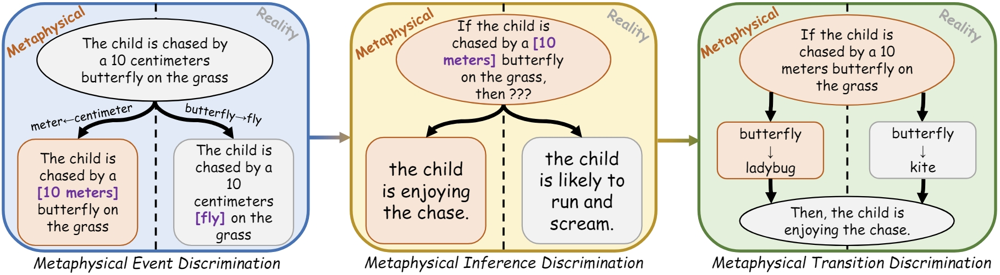

# 🪐MARS: Benchmarking the Metaphysical Reasoning Abilities of Language Models with a Multi-task Evaluation Dataset

This is the official code and data repository for the paper:
[🪐MARS: Benchmarking the Metaphysical Reasoning Abilities of Language Models with a Multi-task Evaluation Dataset](https://arxiv.org/abs/2406.02106).



## 1. Download Dataset/Model Checkpoints

The 🪐MARS benchmark and our best model checkpoints on three tasks in 🪐MARS can be downloaded at [this link](https://hkustconnect-my.sharepoint.com/:f:/g/personal/wwangbw_connect_ust_hk/Em5EKOyH7phOhz7T5hKHuTMBaCie2zy60jLDrcoxFey2Yw).

## 2. Evaluation

To be updated soon!

## 3. Citing this work

Please use the bibtex below for citing our paper:

```bibtex
@inproceedings{MARS,
  author       = {Weiqi Wang and
                  Yangqiu Song},
  title        = {{MARS}: Benchmarking the Metaphysical Reasoning Abilities of Language Models with a Multi-task Evaluation Dataset},
  year         = {2024},
  url          = {https://doi.org/10.48550/arXiv.2406.02106},
  doi          = {10.48550/arXiv.2406.02106}
}
```

## 4. Acknowledgement

The authors of this paper were supported by the NSFC Fund (U20B2053) from the NSFC of China, the RIF (R6020-19 and R6021-20), and the GRF (16211520 and 16205322) from RGC of Hong Kong. We also thank the support from the UGC Research Matching Grants (RMGS20EG01-D, RMGS20CR11, RMGS20CR12, RMGS20EG19, RMGS20EG21, RMGS23CR05, RMGS23EG08). 